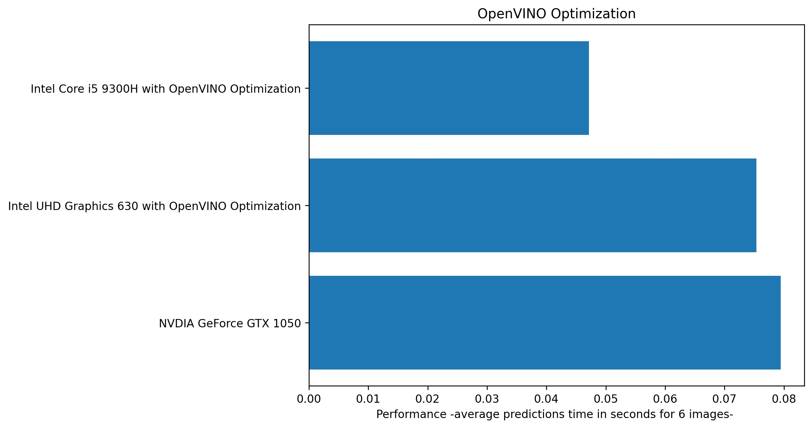

Hi again :)

OpenVINO™ toolkit is a comprehensive toolkit for quickly developing applications and solutions that solve a variety of tasks including emulation of human vision, automatic speech recognition, natural language processing, recommendation systems, and many others. Based on latest generations of artificial neural networks, including Convolutional Neural Networks (CNNs), recurrent and attention-based networks, the toolkit extends computer vision and non-vision workloads across Intel® hardware, maximizing performance. It accelerates applications with high-performance, AI and deep learning inference deployed from edge to cloud.

In this study, the response time of the model was measured from a simple deep learning network, regardless of its accuracy.

Here is the results :

Apart from OpenVINO optimization, which is especially used for computer vision, it brings many developers add-ons.

I can't load model because its so big 😄 ( 220 MB and the optimized model is 207 MB )
